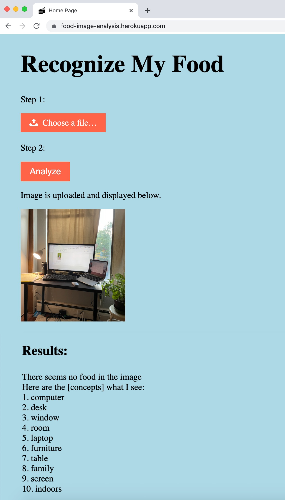

# Food Image Analysis Web App

This web app 
* analyzes the food in the uploaded picture and 
* reports the nutrition facts of the food. 

It is built with [Flask](https://flask.palletsprojects.com/en/2.0.x/) and deployed on Heroku. You can test it [here](https://food-image-analysis.herokuapp.com/). 

## Example 1

## Example 2

